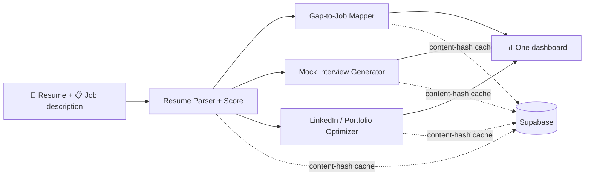

<div align="center">

# HireOrHigher

**Know exactly where you stand.**

Upload one resume, paste one job description — and get an ATS score, a semantic skills-gap map, a tailored mock interview, and rewritten LinkedIn/portfolio copy, all on a single dashboard.

[](https://hierorhigher.vercel.app/)


</div>

---

## Overview

HireOrHigher is an AI-powered career-readiness platform. A user uploads **one resume** and pastes **one job description**; four connected modules run against that single input and land on one dashboard.

Every module result is persisted in Supabase and keyed by content hash, so reloading the dashboard re-renders previous results with **zero** re-processing — and identical inputs never spend Gemini quota twice.

## ✨ Features

| # | Module | What it does |
|---|---|---|
| 1 | **Resume Parser + Score** | Structured parsing plus a dual score: a deterministic, rule-based ATS score and an LLM-judged human-readability score, each with a breakdown of what drove it. |
| 2 | **Gap-to-Job Mapper** | Embedding-based (semantic, not keyword) comparison of the parsed resume against the JD: matched skills, missing skills, match percentage, and a skill-gap radar of coverage by category. |
| 3 | **Mock Interview Generator** | 8–10 questions tagged Technical / Behavioral / Role-Fit, written from the candidate's actual projects, history, and identified gaps. |
| 4 | **LinkedIn / Portfolio Optimizer** | Headline, About section, and outcome-oriented project rewrites, each in Concise and Detailed tone variants. |

Beyond the per-resume modules: a **cross-run analytics dashboard** — a histogram of your match percentages across every job description you've mapped — and **Google OAuth** sign-in alongside email/password.

## 🧑‍💼 For recruiters — the hiring side

The same engine, pointed the other way. A recruiter creates an **organization**, posts a role, and shares its **public apply link**. Candidates open that link with **no account**: they attach a résumé, submit, and are done — no login, no dashboard, no profile to maintain. Each submission is parsed and scored against the posting's description, and the hiring team gets a **screening list ranked by match percentage**, with matched and missing skills per applicant.

It is a closed ATS, not a marketplace, and the boundaries are enforced rather than assumed:

- **Candidates are never authenticated.** No Supabase auth user is created for them, and their rows carry no `auth.uid()` at all — `candidates` and `applications` have RLS enabled with *no policies*, so direct client access is default-denied and every read goes through an org-gated backend route.
- **Candidates are visible only to the org they applied to.** There is no cross-org search, no shared candidate pool, and a posting id grants nothing on its own — access is re-derived from org membership on every request.
- **Scores are recruiter-only.** The apply page's confirmation deliberately carries no match percentage and no skill breakdown.
- **The same matching core** scores a candidate against a posting as scores a student against a pasted JD — one implementation (`match_resume_to_jd`), read from two sides.
- **The public endpoint is throttled** per posting + client IP with the same sliding-window limiter the signed-in uploads use, and gets identical upload validation: magic-byte content-type checks, a size cap, and the same garbled-parse guard.

Recruiters are ordinary accounts — org membership is the only thing that makes one a recruiter, so the hiring console lives at `/hiring` behind the existing sign-in.

## 🔄 How it works



One upload feeds every module. Each result is cached by content hash in Supabase, so reopening the dashboard replays previous results instantly and never re-spends Gemini quota on identical input.

## 🧱 Tech stack

- **Frontend** — React + Tailwind, built with Vite
- **Backend** — FastAPI (Python)
- **AI** — Google Gemini (structured output + embeddings)
- **Auth** — Supabase Auth (email/password + Google OAuth)
- **Data** — Supabase (PostgreSQL + Storage), row-level security per user

## 🏗️ Architecture & engineering notes

- **Caching:** resumes hash by file bytes, JDs by text, cross-module results by `sha256(resume_hash : jd_hash)` — every service checks Supabase before calling Gemini, so nothing is ever computed twice.
- **Isolated Gemini quota:** each of the four modules uses its own dedicated API key, so one module hitting a rate limit or cost ceiling never blocks the others.
- **Prompt-injection defense:** resumes and JDs are wrapped in `<user_submitted_content>` tags, and every prompt file instructs the model to treat that content strictly as data.
- **Safe uploads:** content-type is verified by magic-byte inspection (not file extension), with a 5 MB cap, sanitized filenames, and a per-user sliding-window rate limit.
- **Resilient Gemini calls:** every call has a timeout and one retry; failures surface as a specific 502 the UI renders as an inline error state, and garbled parses (fewer than 2 structured fields) return a clear re-upload prompt.
- **Cohesive UI:** one design-token set (ink/gold/paper palette, Fraunces + Inter) shared by the cinematic dark landing page and the functional dashboard — animated score gauges, step-by-step loaders, skeletons, scroll-reveals, and reduced-motion support throughout.

## 🔌 API

All routes are prefixed with `/api` and require an authenticated Supabase session (Bearer token).

| Method & path | Purpose |
|---|---|
| `GET /health` | Service health check |
| `POST /resumes` | Upload, parse, and score a resume |
| `GET /resumes` | List the caller's resumes |
| `GET /resumes/{id}/overview` | Full dashboard state — all four modules in one call |
| `POST /gap-reports` | Map a job description against a resume |
| `POST /interview-sets` | Generate a mock interview set |
| `POST /profile-drafts` | Generate LinkedIn / portfolio rewrites |
| `GET /analytics/gap-distribution` | Match-percentage distribution across all your gap reports |

Recruiter side — authenticated and gated on membership of the org that owns the resource:

| Method & path | Purpose |
|---|---|
| `POST /organizations` | Create an org (caller becomes its first admin) |
| `GET /organizations` | Orgs the caller belongs to |
| `GET`/`POST /organizations/{id}/members` | Read the roster; invite a teammate by email (admin-only) |
| `POST`/`GET /job-postings` | Create a posting; list one org's postings |
| `GET`/`PATCH /job-postings/{id}` | Read a posting; edit it or close it |
| `GET /job-postings/{id}/applications` | Applicants ranked by match, with matched/missing skills |

And the only unauthenticated routes in the app, behind a posting's public apply link:

| Method & path | Purpose |
|---|---|
| `GET /apply/{posting_id}` | The role and org name, for an open posting only |
| `POST /apply/{posting_id}` | Submit a résumé — no account, no session, rate-limited per posting + IP |

Each module also exposes read-only history routes (`GET /{module}?resume_id=…` and `GET /{module}/{id}`) that replay past runs straight from Supabase with no Gemini call. Interactive OpenAPI docs are served at `/docs`.

## 📁 Repository layout

```
backend/
  app/
    api/routes/     # one route file per feature area (health, resumes, gap, interviews, profiles, analytics)
    api/deps.py     # auth, repository, per-module Gemini clients, rate limit
    core/           # Gemini wrapper (timeout + retry-once), hashing, file validation, prompt loader
    db/             # Supabase client + repository (the only DB touchpoint)
    models/         # Pydantic contracts — the exact request/response shapes
    prompts/        # versioned Gemini prompt files, one per module (never inline strings)
    services/       # one service per module's Gemini-calling logic + rule-based ATS scorer
  tests/            # integration tests per module, driven by the sample dataset
supabase/migrations/  # SQL migrations — RLS enabled in the same file as each CREATE TABLE
scripts/seed.py       # loads the sample dataset for an instant, Gemini-free demo
data/samples/         # sample resumes + JDs (test fixtures and seed source)
frontend/             # Vite + React + Tailwind app (landing, auth, dashboard, analytics)
```
